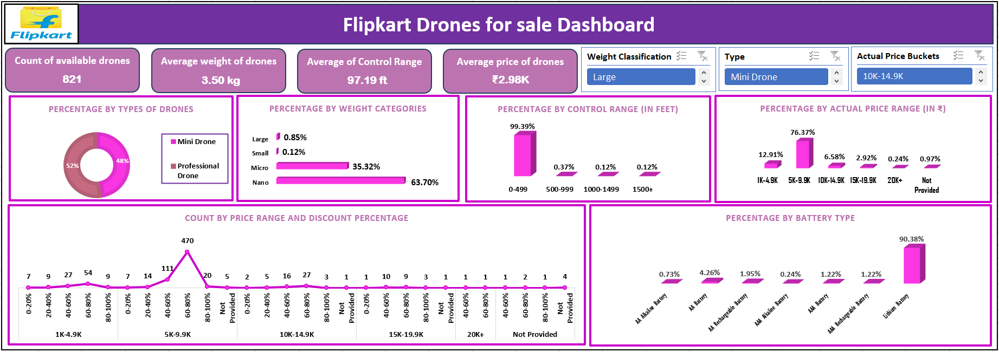

🛸 Flipkart Drones Dashboard (Excel Project)
📌 Project Overview

This project showcases an Excel Dashboard analyzing drones listed on Flipkart.
The dashboard provides insights into product availability, pricing, specifications, and discount patterns, offering valuable perspectives for buyers, sellers, and e-commerce analysts.

🎯 Objectives

Clean and prepare raw product data

Build an interactive Excel Dashboard with slicers, pivot tables, and charts

Highlight key business insights such as pricing trends, product mix, and customer-oriented features

Demonstrate Excel’s capability as a data visualization and business intelligence tool

📊 Key Insights from Dashboard

Total drones available: 821

Average weight: 3.50 kg | Average control range: 97 ft

Average price: ₹2.98K

Drone types: Professional (52%) vs Mini (48%)

Battery type: Lithium dominates with 90% share

Price range: 76% of drones fall between ₹5K–₹9.9K

Discounts: Most drones show 60–80% discount patterns

Control range: 99% of drones under 500 ft

🛠️ Skills & Tools Demonstrated

Excel (Pivot Tables, Pivot Charts, Slicers, Conditional Formatting)

Data Cleaning & Preparation

Interactive Dashboard Design

Data Storytelling & Business Insights

📸 Dashboard Preview

🚀 Learning Takeaways

Excel can be used beyond simple spreadsheets — it is a powerful BI tool

Data visualization helps convert raw e-commerce data into actionable insights

Discount trends and price clustering play a key role in customer purchase behavior
Data visualization helps convert raw e-commerce data into actionable insights

Discount trends and price clustering play a key role in customer purchase behavior
